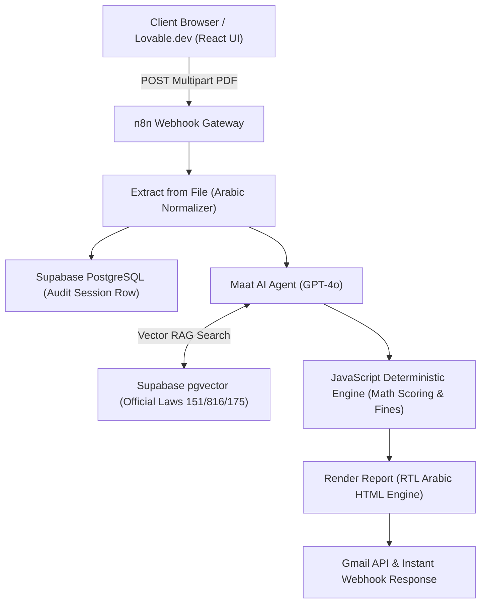
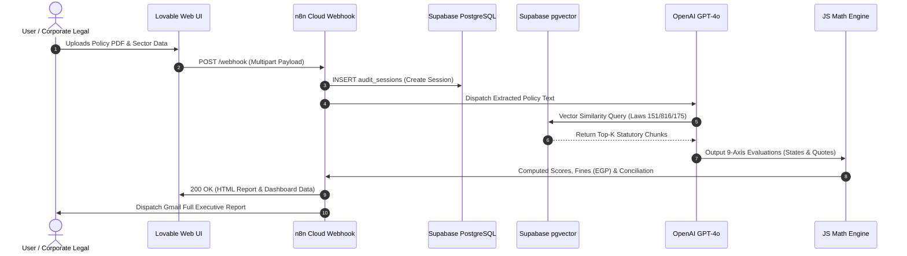

# AI Regulatory Compliance & Cyber-Legal Defense Engine
**Digital Egypt Pioneers Initiative (DEPI) — Industry Track**

### Team Members:
- Mohamed Hosny (Project Lead & Legal Framework Lead)
- Shaimaa Khaled (System Analyst & UI/UX Lead)
- Yara Tarek (Knowledge Base & Data Engineer)
- Ahmed El-Sherif (Workflow Automation Engineer)
- Mohamed Abdelhaleem (QA & Cyber Testing Lead)

### Milestone Deliverables:
- [x] **Milestone 1:** [Project_Planning_and_Management_DEPI_Milestone_1.pdf](./Project_Planning_and_Management_DEPI_Milestone_1.pdf)
- [x] **Milestone 2:** [Milestone_2_System_Analysis_and_Design_DEPI_Final.pdf](./Milestone_2_System_Analysis_and_Design_DEPI_Final.pdf)

## System Architecture & Interaction Workflows

### 1. High-Level Component Architecture

### 2. End-to-End Sequence Diagram

